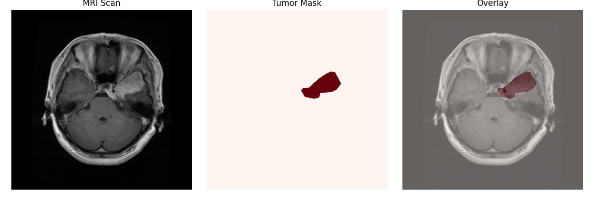
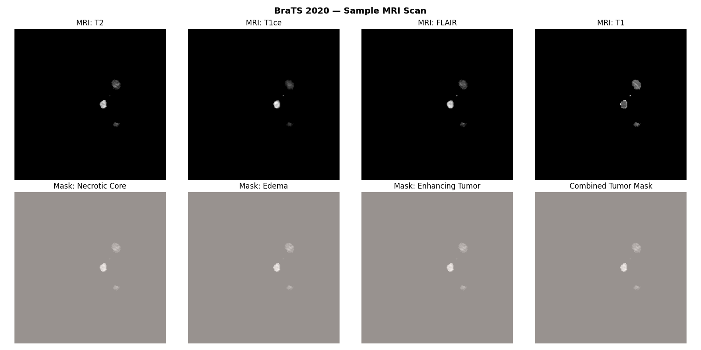
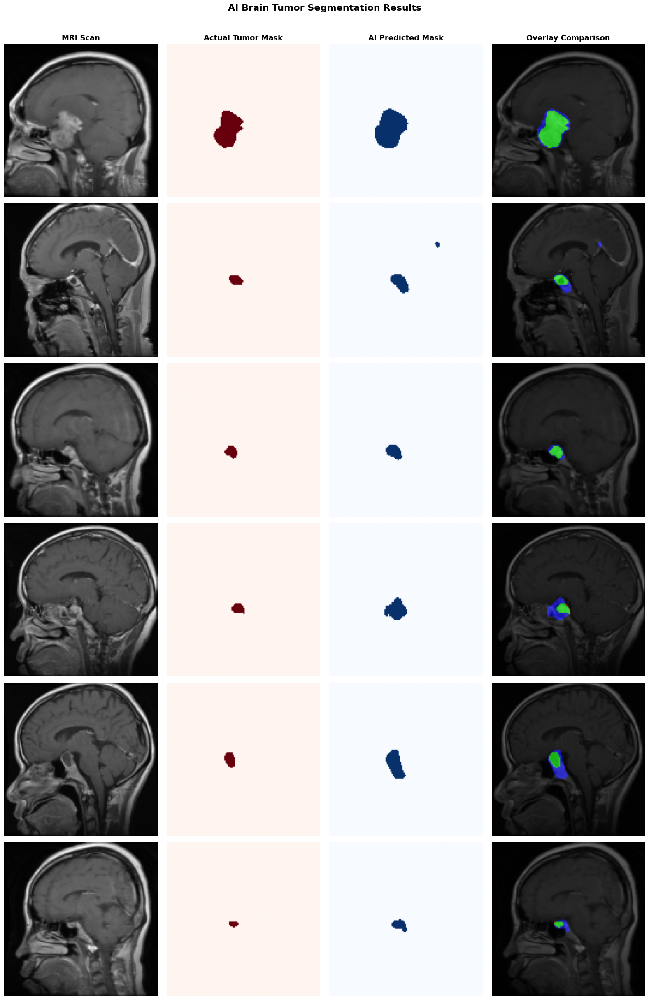
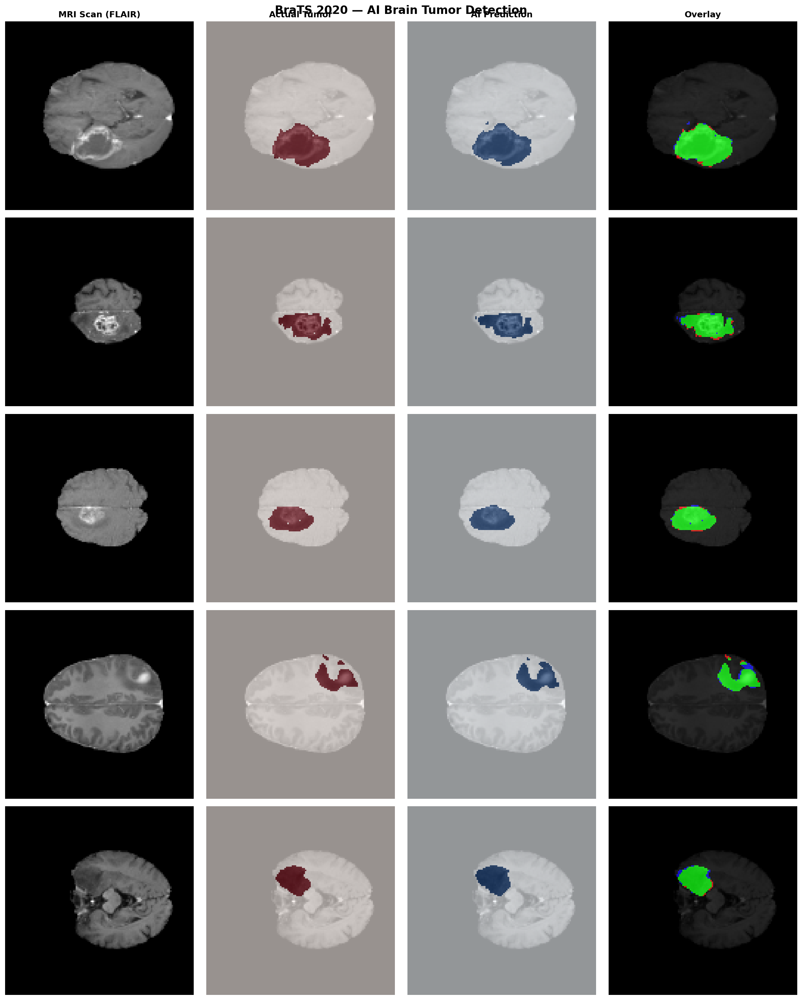

# Brain Tumor Detection Using MRI Image Segmentation
**AI-Powered Brain Tumor Detection — MBA Business Analytics Project – Amity University Online**

## About the Project

Brain tumors represent one of the most lethal forms of cancer and the benefit of early detection cannot be overstated. Manual analysis of MRI is time-consuming and reliant on specialist skill. This project solves that problem by creating an AI segmentation pipeline which automatically identifies and localizes tumor areas from MRI scans.

The model was trained on the U-Net deep learning architecture and tested on two publicly available datasets, Figshare and BraTS 2020. We used the same model architecture for both datasets with a variation in input channels. This huge performance difference shows how much the quantity and quality of imaging data affects model output. This project does pixelwise, rather than blurry classification, it tells you exactly where in the scan the tumor is, which is much more useful from a clinical perspective than just a yes/no answer.

---

## Student
**Mohammad Yasir Siddiqui** — MBA Business Analytics, 4th Semester, Amity University Online

---

## Datasets

**Dataset 1 — Figshare Brain Tumor Dataset**

The dataset contains 3,077 T1-contrast enhanced MRI slices covering three tumor types: Meningioma, Glioma, and Pituitary Tumor. Files are in `.mat` format (HDF5 v7.3) and must be read using `h5py` — scipy cannot open this format. Each file contains the MRI image, tumor mask, and tumor type label.

Source: [figshare.com/articles/dataset/brain_tumor_dataset/1512427](https://figshare.com/articles/dataset/brain_tumor_dataset/1512427)

**Dataset 2 — BraTS 2020**

The BraTS dataset contains 57,195 MRI slices with four imaging sequences per scan: T1, T2, T1ce (contrast-enhanced), and FLAIR. Each slice also includes masks for three tumor sub-regions: Necrotic Core, Peritumoral Edema, and Enhancing Tumor. This multi-channel structure gives the model significantly more information to learn from compared to Figshare's single channel.

Source: [Kaggle — awsaf49/brats2020-training-data](https://www.kaggle.com/datasets/awsaf49/brats2020-training-data)

---

## Repository Structure

```
BrainTumorDetection/
│
├── Brain_Tumor_Detection.ipynb
│
├── outputs/
│   ├── figshare_sample.png
│   ├── brats_sample.png
│   ├── prediction_results.png
│   ├── brats_results.png
│    
└── README.md
```

> The raw dataset files and trained model weights are not included due to size limits. The notebook regenerates everything from scratch when run. Dataset download links are provided above.

---

## Methodology

**Preprocessing**
All images were normalized to [0, 1] and resized to 128×128. Figshare masks were binarized to a single tumor/no-tumor channel. BraTS slices with no tumor region were filtered out before training, and all four channels were normalized independently. Due to the size of the BraTS dataset (57k files), a file-based generator was used during training instead of loading everything into RAM.

**Model Architecture — U-Net**
The U-Net consists of three encoder blocks (32 → 64 → 128 filters), a bottleneck layer (256 filters), and three decoder blocks with UpSampling and skip connections. BatchNormalization and Dropout (0.2–0.3) are applied throughout. The output layer uses a sigmoid activation for binary segmentation. The same architecture (~1.95M parameters) was used for both datasets — only the input shape differs: `(128, 128, 1)` for Figshare and `(128, 128, 4)` for BraTS.

**Loss Functions**
For Figshare, a combined Dice Loss and Weighted Binary Cross Entropy (49× weight on tumor pixels) was used to handle severe class imbalance — tumor pixels make up only ~1.7% of any image. For BraTS, Dice Loss was combined with Tversky Loss (α=0.3, β=0.7), which penalizes missed tumors more heavily than false alarms.

**Training**
Both models were trained using the Adam optimizer (lr=1e-4) with EarlyStopping (patience=6), ReduceLROnPlateau (patience=3), and ModelCheckpoint saving the best model only. Figshare used batch size 16 and stopped at epoch 15. BraTS used batch size 8 due to Colab RAM limits and stopped at epoch 13.

**Evaluation**
Predictions were thresholded at 0.5 and compared against ground truth masks using Accuracy, Precision, Recall, F1 Score, and Dice Score.

---

## Results and Visualizations

**Figshare Sample — MRI Scan + Tumor Mask**



MRI scan alongside its doctor-labeled tumor mask and the AI-predicted mask. The Figshare dataset provides only a single T1-contrast channel, which limits how well the model can distinguish tumor boundaries.

**BraTS Sample — Multi-Channel MRI**



BraTS scans include four MRI sequences per slice. Each sequence highlights different tissue properties, giving the model substantially more information to identify tumor boundaries accurately.

**Prediction Results — Figshare**



Side-by-side comparison of ground truth masks and model predictions on Figshare test scans.

**Prediction Results — BraTS 2020**



BraTS predictions show significantly tighter alignment with ground truth masks, reflecting the benefit of multi-channel MRI input.

---

## Model Performance

**Dataset 1 — Figshare** (1 MRI channel)

| Metric | Score |
|--------|-------|
| Accuracy | 98.57% |
| Precision | 55.36% |
| Recall | 70.01% |
| F1 Score | 61.83% |
| **Dice Score** | **61.83%** |

**Dataset 2 — BraTS 2020** (4 MRI channels)

| Metric | Score |
|--------|-------|
| Accuracy | 99.67% |
| Precision | 93.38% |
| Recall | 93.90% |
| F1 Score | 93.64% |
| **Dice Score** | **93.64%** |

The Dice Score improved from 61.83% to 93.64% using the exact same U-Net architecture. The difference is entirely due to the number of MRI channels available. Figshare's single T1-contrast channel provides limited tissue contrast, while BraTS's four sequences give the model a far richer view of tumor boundaries.

It is also important to note that Figshare's 98.57% accuracy is misleading. Because tumor pixels are only ~1.7% of any scan, a model that predicts all-background already achieves ~98% accuracy automatically. Dice Score is the meaningful metric — it only scores well if the tumor region is actually found correctly.

| Improvement | Value |
|-------------|-------|
| Precision | +38.02% |
| Recall | +23.89% |
| Dice Score | +31.81% |

---

## How to Run

1. Clone or download this repository
2. Install dependencies:
```
pip install tensorflow h5py==3.11.0 scikit-image scikit-learn matplotlib numpy
```
3. Set up Google Drive folder structure:
```
MyDrive/brain_tumor_project/
├── data/          ← Figshare .mat files
├── brats/data/    ← BraTS zip file (auto-unzipped by notebook)
└── outputs/       ← models and results saved here automatically
```
4. Open `Brain_Tumor_Detection.ipynb` in Google Colab, mount Drive, and run all cells top to bottom
   - Cells 1–9: Figshare pipeline
   - Cells 10–19: BraTS pipeline

> **Note:** Use h5py version 3.11.0 exactly — version 3.16 conflicts with TensorFlow. No OpenCV (cv2) is used anywhere in this project; all image operations use scikit-image and PIL.

---

## Conclusions

These results indicate that deep learning approaches for MRI tumor segmentation yield high clinical performance when given sufficient imaging data. Therefore, the U-Net architecture was suitable for single-channel and multi-channel inputs, since the BraTS model achieved a Dice Score of 93.64% which is a clinically-relevant outcome.

Something of extreme importance that we found in this analysis is that performance does not depend solely on model architecture. Importance of Input Data: Just like output, the input data matters too. A better improvement I had from going from one MRI channel to 4 was a 31.81% increase in Dice Score with no model design change

Other limitations are the use of 2D slice-based segmentation instead of full 3D volumetric analysis, and the training of models on public benchmark data rather than real clinical scans. In future work, I plan to explore 3D U-Net architectures, segmentation of multi-class tumor regions and deployment as a clinical decision support tool.

---

## Tools and Technologies

Python · TensorFlow/Keras · h5py · scikit-image · NumPy · Matplotlib · Google Colab · Google Drive

---

## References

1. Ronneberger et al. (2015) — U-Net: Convolutional Networks for Biomedical Image Segmentation
2. Menze et al. (2015) — The Multimodal Brain Tumor Image Segmentation Benchmark (BraTS)
3. Bakas et al. (2017) — Advancing The Cancer Genome Atlas glioma MRI collections
4. Havaei et al. (2017) — Brain Tumor Segmentation with Deep Neural Networks
5. Pereira et al. (2016) — Brain Tumor Segmentation Using CNN in MRI Images
6. Louis et al. (2016) — WHO Classification of Tumors of the Central Nervous System
7. Ostrom et al. (2019) — CBTRUS Statistical Report
8. Gordillo et al. (2013) — State of the art survey on MRI brain tumor segmentation
9. Akkus et al. (2017) — Deep Learning for Brain MRI Segmentation
10. Zhao et al. (2018) — A deep learning model integrating FCNNs and CRFs for brain tumor segmentation

---

## Contact

For any questions, feedback, or collaboration opportunities, please reach out at:
**yasirfcb14@gmail.com**
